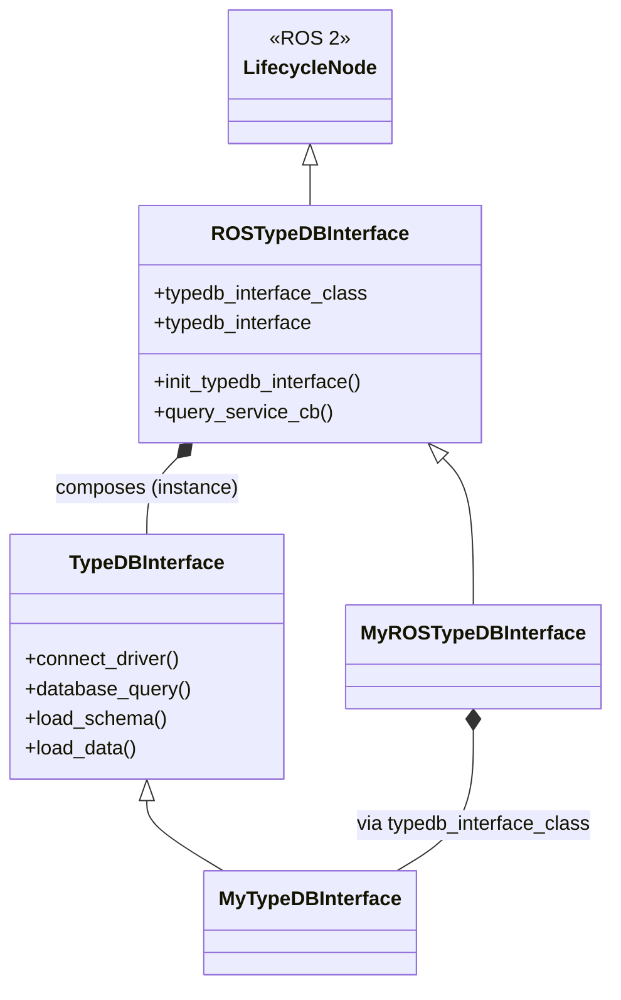

# ros_typedb
[](https://github.com/Rezenders/ros_typedb/actions/workflows/test.yml)
[](https://github.com/Rezenders/ros_typedb/actions/workflows/doc.yml)

This package provides a generic integration between ROS 2 and [TypeDB](https://typedb.com/) (TypeDB 3).
The package is designed so users can extend query behavior while reusing the existing ROS lifecycle/query interfaces.

This package is tested on Ubuntu 22.04 with ROS 2 Humble and TypeDB 3.

## Install

To use this package, install ROS 2 Humble and TypeDB 3.

#### Install ROS2 Humble

Follow the [official instructions](https://docs.ros.org/en/humble/Installation/Ubuntu-Install-Debians.html).

#### Install TypeDB 3

Install TypeDB following the official documentation: https://typedb.com/docs/home/

For development, this repository provides `Dockerfile` with TypeDB 3 server and Python driver support.

Before running build, tests, launch, or query commands, make sure the TypeDB server is running.

#### Install ros_typedb package

Create a ROS workspace and clone the repository:

```bash
mkdir -p ~/typedb_ws/src
cd ~/typedb_ws/src
git clone https://github.com/kas-lab/ros_typedb.git
```

Install dependencies:

```bash
source /opt/ros/humble/setup.bash
cd ~/typedb_ws
rosdep install --from-paths src --ignore-src -r -y
```

Build:

```bash
cd ~/typedb_ws
colcon build --symlink-install
source install/setup.bash
```

This repository contains four packages:

- `typedb_utils`: reusable, non-ROS TypeDB 3 Python interface and helper layer
- `ros_typedb_msgs`: ROS messages/services used by the TypeDB node
- `ros_typedb`: ROS lifecycle/query integration for TypeDB 3
- `ros_typedb_tools`: CLI helpers for generating schema and TypeDB 3 function diagrams from `.tql` files

## Run with Docker

Build the TypeDB 3 image:

```bash
docker build -t ros_typedb .
```

If you want to use TypeDB Studio, allow X access:

```bash
xhost +
```

Start dev container with display and repository mounted:

```bash
docker run -it --rm --name ros_typedb -e DISPLAY=$DISPLAY -e QT_X11_NO_MITSHM=1 -v /dev/dri:/dev/dri -v /tmp/.X11-unix:/tmp/.X11-unix -v /etc/localtime:/etc/localtime:ro -v $HOME/typedb_ws/src/ros_typedb:/home/ubuntu-user/typedb_ws/src/ros_typedb ros_typedb
```

Start dev container without display:

```bash
docker run -it --rm --name ros_typedb -v /etc/localtime:/etc/localtime:ro -v $HOME/typedb_ws/src/ros_typedb:/home/ubuntu-user/typedb_ws/src/ros_typedb ros_typedb
```

Start new terminal in container:

```bash
docker exec -it ros_typedb bash
```

Start container in background with TypeDB server running:

```bash
docker run -d --rm --name ros_typedb -v /etc/localtime:/etc/localtime:ro -v $PWD:/home/ubuntu-user/typedb_ws/src/ros_typedb ros_typedb sudo typedb server
```

## Package Design

The repository is centered around two layers:

- `TypeDBInterface` in `typedb_utils/typedb_utils/typedb_interface.py`
- `ROSTypeDBInterface` in `ros_typedb/ros_typedb/ros_typedb_interface.py`

`ROSTypeDBInterface` is a ROS 2 lifecycle node exposing:

- `~/query` service (`ros_typedb_msgs/srv/Query.srv`) for insert/delete/fetch/get/update operations
- `~/events` topic (`std_msgs/String`) for insert/delete events

`TypeDBInterface` manages connection, schema/data loading, and query execution against TypeDB. `ros_typedb` depends on `typedb_utils` rather than embedding that generic layer directly.

Class diagram:



Overview:
<p align="center">
  
</p>

## Using the package

Recommended: launch the lifecycle node through the provided launch file (it auto-configures/activates):

```bash
ros2 launch ros_typedb ros_typedb.launch.py schema_path:="['/absolute/path/schema.tql']" data_path:="['/absolute/path/data.tql']"
```

Run node directly:

```bash
ros2 run ros_typedb ros_typedb
```

If running directly, manage lifecycle state transitions before sending queries.

## Extend the package

Use composition for custom features:

- Keep query/domain logic in plain Python classes.
- Inject `TypeDBInterface` into those classes.
- Optionally create a `ROSTypeDBInterface` subclass only to wire ROS lifecycle/services.

Custom query class (no inheritance from `TypeDBInterface`):

```python
from typedb_utils.typedb_interface import TypeDBInterface


class PeopleQueries:
    def __init__(self, db: TypeDBInterface):
        self.db = db

    def fetch_people(self):
        return self.db.fetch_database(
            'match $p isa person; fetch { "email": $p.email };'
        )

    def add_person(self, email: str):
        return self.db.insert_entity('person', [('email', email)])
```

Custom ROS interface (wiring/composition only):

```python
from ros_typedb.ros_typedb_interface import ROSTypeDBInterface
from my_queries import PeopleQueries


class MyROSTypeDBInterface(ROSTypeDBInterface):
    def __init__(self, node_name='my_typedb_node', **kwargs):
        super().__init__(node_name, **kwargs)

    def on_configure(self, state):
        result = super().on_configure(state)
        self.people_queries = PeopleQueries(self.typedb_interface)
        return result
```

Spin ROS node:

```python
import rclpy
from rclpy.executors import MultiThreadedExecutor


def main():
    rclpy.init()
    node = MyROSTypeDBInterface()
    executor = MultiThreadedExecutor()
    executor.add_node(node)
    try:
        executor.spin()
    finally:
        node.destroy_node()
        rclpy.shutdown()
```

## Example of packages using ros_type

- [ROSA](https://github.com/kas-lab/rosa/tree/main/rosa_kb)
- [navigation_graph_map](https://github.com/kas-lab/navigation_graph_map/tree/main/navigation_kb)

## Run tests

Feature/integration tests in Docker:

```bash
scripts/run-tests-docker.sh
```

Mandatory style/docstring checks:

```bash
scripts/run-mandatory-checks-docker.sh
```

Manually:

```Bash
colcon test --event-handlers console_cohesion+ --packages-select typedb_utils ros_typedb ros_typedb_tools
```

## Schema and Rule Diagram Tools

The `ros_typedb_tools` package provides:

- `typedb_schema_diagram`
- `typedb_rule_diagram`

Examples:

```bash
ros2 run ros_typedb_tools typedb_schema_diagram \
  --input /absolute/path/schema.tql \
  --format dot \
  --output /tmp/schema.dot

ros2 run ros_typedb_tools typedb_rule_diagram \
  --input /absolute/path/functions.tql \
  --output /tmp/functions.svg
```

`typedb_rule_diagram` now renders TypeDB 3 `fun` dependency/read graphs rather than TypeDB 2 rule graphs.
See `ros_typedb_tools/README.md` for the full CLI reference.

## Acknowledgments

<a href="https://remaro.eu/">
    
</a>

This work is part of the Reliable AI for Marine Robotics (REMARO) Project. For more info, please visit: <a href="https://remaro.eu/">https://remaro.eu/

<br>

<a href="https://research-and-innovation.ec.europa.eu/funding/funding-opportunities/funding-programmes-and-open-calls/horizon-2020_en">
    
</a>

This project has received funding from the European Union's Horizon 2020 research and innovation programme under the Marie Skłodowska-Curie grant agreement No. 956200.
